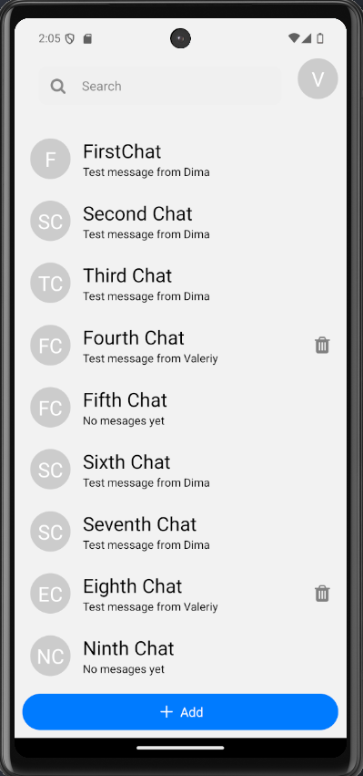
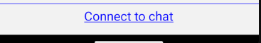

## _Chat application_

Як працює:
 -Щоб додати чат:

  1. Натиснути кнопку "Add" знизу екрана.
    

  2. Після відкриття діалогового вікна, вписати назву чату і натиснути додати (доданий чат завжди буде з назвою "New chat").

  -Щоб видалити чат:

  1.Натиснути на іконку видалення в правій частині чату. Іконку видно тільки, якщо користувач сам створив цей чат. (Видалиться завжди 4-ий чат.)

  -Щоб підключитись до чату:

  1.Зайти в чат.
  2.Натиснути "Connect to chat" (краще за все підключатись до чату 1).
    

  -Відправка повідомлень:

  1. Після відправки повідомлень буде отримано таку ж саму відповідь, що свідчить про підключення до WebSocket сервера.
